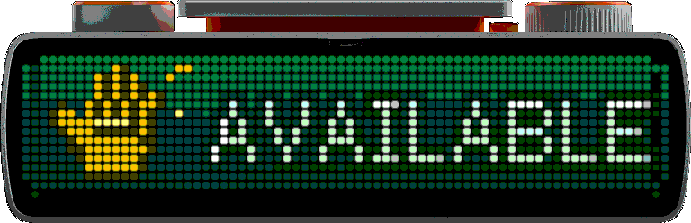
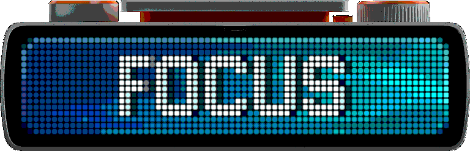
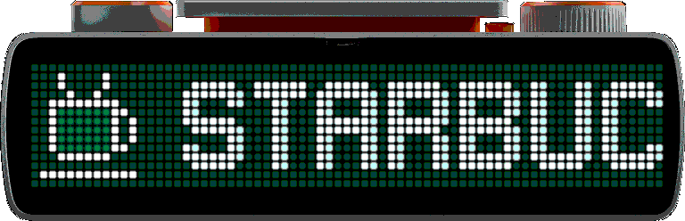
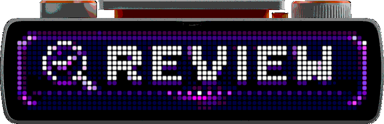
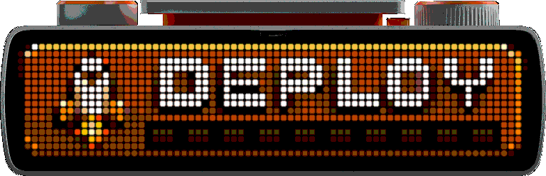
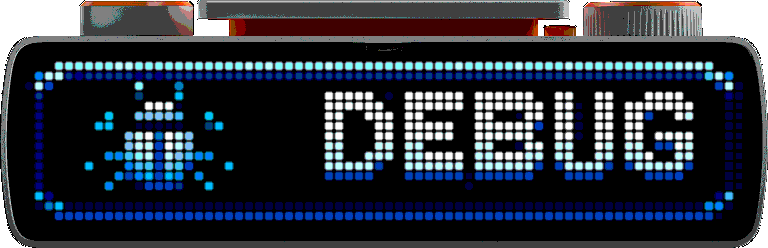

# BUSY Bar Animations

A curated collection of installable 72x16 animations for BUSY Bar.

Browse the catalog below, download an animation directly, or use the [web installer](https://lxdb.github.io/bsb-anims/) from desktop Chrome or Edge.

## Install from the browser

1. Open the [web installer](https://lxdb.github.io/bsb-anims/) in desktop Chrome or Edge.
2. Select **Connect**, confirm the BUSY Bar URL, and enter its 4-10 digit access key or paste a 32-character access token.
3. Approve the browser's local-network request.
4. Select **Install** or **Update** on an animation card.

The installer keeps the device URL and credential in memory only. Reload or disconnect to clear them. Other browsers can browse the catalog and download each `.anim` file for manual installation.

<!-- catalog:start -->
## Available

Let others know you're available.

72x16, 60 FPS - [Download .anim](animations/available/animation.anim)

## Focus

Signal deep work mode. Do not disturb.

72x16, 60 FPS - [Download .anim](animations/focus/animation.anim)

## Starbucks

Fueling productivity, one cup at a time.

72x16, 60 FPS - [Download .anim](animations/starbucks/animation.anim)

## Review

In review. Feedback appreciated.

72x16, 60 FPS - [Download .anim](animations/review/animation.anim)

## Deploy

Shipping awesome things.

72x16, 60 FPS - [Download .anim](animations/deploy/animation.anim)

## Debug

Finding bugs. Please stand by.

72x16, 60 FPS - [Download .anim](animations/debug/animation.anim)
<!-- catalog:end -->

## Add an animation

Animation artifacts belong on `main`. Put a compiled `animation.anim` and a 72x16 `framebuffer.gif` under `animations/<id>/`, add the catalog entry, and run `cataloggen.py generate` from a `tooling` worktree.

Then review the framed GIF, run `cataloggen.py check`, and commit the artifact, generated manifest, catalog, preview, and README changes together. Do not add source ZIPs, expanded PNG frame directories, authoring generators, or website code to `main`.

The repository intentionally separates concerns:

- `main` contains the catalog and downloadable artifacts.
- `tooling` contains the Python preview/catalog generator.
- `site` contains the static GitHub Pages application.

## License

Original project work is MIT-licensed. The official BUSY Bar device frame and generated previews that incorporate it retain the firmware's GPL-2.0-or-later notice. See [THIRD_PARTY_NOTICES.md](THIRD_PARTY_NOTICES.md).

Starbucks and its marks belong to their respective owner. This project is not affiliated with or endorsed by Starbucks, and its license grants no trademark rights.
